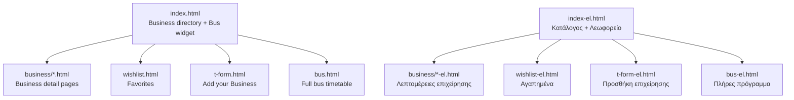
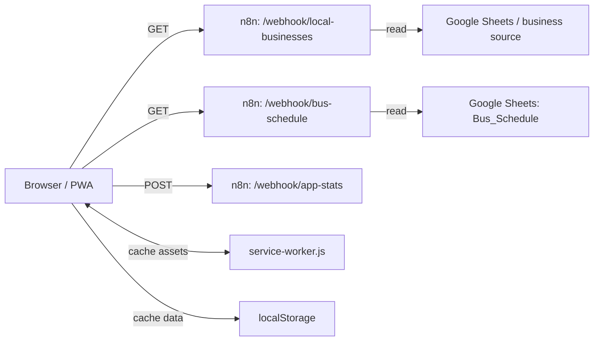

# Kala Nera Website — Architecture & n8n Webhook Hardening

Last updated: 2026-04-23

## Scope

This document captures:

- **Site structure** (pages, responsibilities)
- **Data flow** (browser/PWA ↔ n8n ↔ Google Sheets)
- **Current n8n webhooks used by the frontend**
- **Hardening guidance** for a self-hosted n8n instance on a VPS (RackNerd / USA)

The goal is to keep the solution lightweight (static site + n8n) while reducing risk from:

- scraping / abuse traffic
- unnecessary load on Google Sheets API
- spam on public POST endpoints
- accidental data leakage

---

## 1) Site structure (high level)

### Diagram: pages & navigation



If Mermaid diagrams do not render in your editor preview, use this ASCII version:

```text
index.html / index-el.html (Home)
  ├─ business/*.html + business/*-el.html (Business details)
  ├─ wishlist.html / wishlist-el.html (Favorites)
  ├─ t-form.html / t-form-el.html (Add business)
  └─ bus.html / bus-el.html (Full bus timetable)
```

### Main entry pages

- **`index.html` / `index-el.html`**
  - Business directory UI
  - Bus widget (“Bus today”) at top of content
  - Loads JS: `app.js`
  - Loads CSS: `style.css`

- **`bus.html` / `bus-el.html`**
  - Full-day bus timetable (direction tabs)
  - Also uses `app.js` + `style.css`

- **`wishlist.html` / `wishlist-el.html`**
  - Favorites list (localStorage-driven)

- **`t-form.html` / `t-form-el.html`**
  - Submit business form page(s)

### Detail pages

- **`business/*.html` and `business/*-el.html`**
  - Business detail pages (static HTML, generated/maintained separately)

---

## 2) PWA / caching layers

### PWA manifest

- **`manifest.json`**
  - `start_url: /index.html`
  - `display: standalone`
  - `theme_color` / icons

### Service worker

- **`service-worker.js`**
  - Caches static assets (cache-first for speed; background updates)
  - Keeps images in a separate cache
  - Protects against caching external domains (maps/forms/analytics) by only caching same-origin

### localStorage usage (important for UX and resilience)

- **Businesses**:
  - cached in `localStorage` (`kalanera_offline_data`)
  - used for offline fallback

- **Bus schedule**:
  - cached per direction (`kalanera_bus_schedule_cache_v1`)
  - TTL in frontend (currently 2 minutes)

- **Wishlist**:
  - `kalanera_wishlist`

---

## 3) Runtime data flow (browser ↔ n8n ↔ Google Sheets)

### Diagram: runtime data flow



If Mermaid diagrams do not render in your editor preview, use this ASCII version:

```text
Browser/PWA
  ├─ GET  n8n /webhook/local-businesses  ──► Google Sheets (business source)
  ├─ GET  n8n /webhook/bus-schedule      ──► Google Sheets (Bus_Schedule)
  └─ POST n8n /webhook/app-stats         ──► (stats workflow)

Caching
  ├─ service-worker.js  (assets, same-origin)
  └─ localStorage       (business + bus cache, wishlist, prefs)
```

### Webhooks called by the frontend

From `app.js`:

- **GET** `https://n8n.vanlaar.cloud/webhook/local-businesses`
  - Business directory data

- **GET** `https://n8n.vanlaar.cloud/webhook/bus-schedule`
  - Bus schedule data (filtered by direction, time, day)
  - Source: Google Sheets tab `Bus_Schedule`

- **POST** `https://n8n.vanlaar.cloud/webhook/app-stats`
  - Telemetry / usage stats
  - Important: a public endpoint can be spammed without protections

### Bus schedule contract (recommended stable output)

The frontend works best when n8n returns:

```json
{
  "meta": {
    "tz": "Europe/Athens",
    "now": { "ymd": "YYYY-MM-DD", "hm": "HH:MM", "todayNum": 1 },
    "query": { "from": "Kala Nera", "dir": "volos", "remaining": true, "minutesEarly": 10 },
    "generatedAt": "2026-04-23T18:45:47.396Z"
  },
  "items": [
    {
      "departure": "7:45",
      "origin": "Argalasti",
      "destination": "Volos",
      "arrival": "8:20",
      "note_en": "Early ferry connection",
      "note_el": "…",
      "dir": "volos",
      "stop_kalanera": "highway_bakery",
      "days": "1-6",
      "frequency": "Ma-Za"
    }
  ]
}
```

Notes:

- **`dir`** is a machine-friendly key (`volos|milies|argalasti|afissos`).
- **`stop_kalanera`** is a machine-friendly key (`highway_bakery|village_butcher`).
- Frontend currently displays **Stop** + **Runs (Days)**. Frequency can remain in the API, but should not be duplicated in the UI.

---

## 4) Webhook hardening plan (self-hosted n8n on a VPS)

You are not using Cloudflare. That means protections must be done via:

- your reverse proxy (recommended: **Nginx** in front of n8n)
- n8n workflow-level validation (fast reject)
- conservative caching to avoid hitting Google Sheets too often

### 4.1 Minimum recommended protections (do these first)

#### A) Reverse proxy in front of n8n (Nginx)

Implement:

- **Rate limiting**:
  - apply per IP and per path
  - stricter for `POST /app-stats`

- **Request size limits** (POST):
  - prevent large payload abuse

- **Timeouts**:
  - avoid hanging connections

- **Access logs**:
  - detect bursts and patterns

Why Nginx: it solves 80% of abuse issues without complicating n8n flows.

#### B) Caching

For GET endpoints (`bus-schedule`, `local-businesses`):

- Set `Cache-Control: public, max-age=60` or `max-age=300`
- Add caching inside n8n if needed (e.g., memory/redis) so Sheets isn’t hit per request

#### C) Validate inputs early in the workflow

In the first Function/IF node:

- allow only expected `dir` values
- clamp numeric params (e.g. `minutesEarly`)
- reject unknown/invalid query combos
- for POST endpoints: validate expected fields and types, drop everything else

#### D) Minimize output fields

- Strip any fields not required by the UI
- Never return sensitive internal values

---

### 4.2 About CORS (important nuance)

**CORS is not security**. It only controls which browser origins can read responses.

Use CORS to:

- make the website work (allow `https://www.kalanera.gr`)
- allow local testing (temporarily `*` or include localhost origins)

But still add:

- rate limiting
- caching
- validation

---

### 4.3 Endpoint-by-endpoint recommendations

#### GET `/webhook/bus-schedule`

Risk: scraping / burst traffic causing Google Sheets reads.

Recommendations:

- **Nginx rate limit** (example): 30 req/min per IP
- **Cache**: 60–300 seconds
- **Validate**:
  - `dir` in `{volos,milies,argalasti,afissos}`
  - `remaining` only `0/1`
  - `minutesEarly` numeric with min/max (e.g. 0–30)
- **Return**: only normalized contract fields

#### GET `/webhook/local-businesses`

Risk: scraping; also can be cached aggressively.

Recommendations:

- Rate limit slightly higher, but still bounded
- Cache longer (e.g. 5–30 minutes) because business list changes less frequently
- Ensure you filter out non-public fields

#### POST `/webhook/app-stats`

Risk: spam, fake analytics, log flooding, excessive writes.

Recommendations:

- **Rate limit** strict (e.g. 10/min per IP)
- **Request size limit** (e.g. 2–8 KB)
- **Validate**: required fields only; drop/ignore unknowns
- **Avoid JSON parsing errors** (frontend already hardened to tolerate empty responses)
- Consider a **nonce/timestamp** and basic sanity checks (e.g. version format)

---

## 5) Tomorrow’s walkthrough checklist

For each existing webhook (even those not in `app.js`):

- Identify: GET/POST, public or internal, called by browser or server-to-server
- Inventory inputs/outputs
- Decide caching policy
- Decide rate limits
- Add validation and consistent error responses
- Confirm CORS policy for production and local testing
- Confirm logging and how to detect abuse (simple thresholds)

---

## Appendix: Values used in Sheets

### Bus directions (`Direction`)

- `volos`
- `milies`
- `argalasti`
- `afissos`

### Kala Nera stops (`Stop_KalaNera`)

- `highway_bakery` (main road stop near bakery)
- `village_butcher` (village/beach road stop near butcher)

