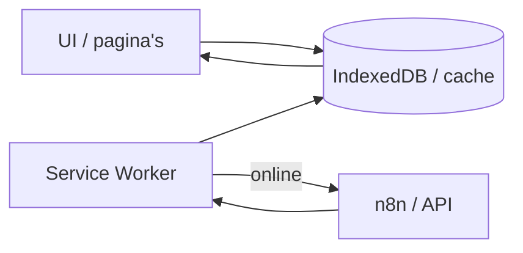

# Offline-first — analyse en roadmap (uitgesteld)

**Status:** uitgesteld — huidige offline-tolerante aanpak behouden.  
**Besluit (mei 2026):** geen offline-first verbouwing vóór Play Store-release en bekendheid; eventueel later herzien.  
**Context:** vraag hoe de app volledig standalone (offline) kan werken zonder impact bij wegvallende verbinding, met automatische verversing zodra het net terug is.

---

## Besluit en prioriteit

| Nu | Later (optioneel) |
|----|-------------------|
| Focus op **Google Play** (TWA), review-acceptatie na eerste afwijzing, testen op devices | Offline-first in fases (zie hieronder) |
| Huidige PWA + cache-gedrag **niet** vervangen | Kleine verbeteringen (Laag 1) zonder architectuurwijziging |
| n8n + Sheet blijven leidende databron op de server | Same-origin snapshots + uitgebreidere SW-precache (Laag 2) |

**Conclusie:** dit is **geen** verplichte totale verbouwing. De bestaande site/TWA-setup blijft geschikt voor launch; een echte offline-first strategie is een apart project na stabiliteit en groei.

---

## Huidige stand (wat er al is)

De app is een **PWA** (o.a. `manifest.json`, `service-worker.js`) en wordt voor Play verpakt als **TWA** (`kalanera-twa/`, zie [`google-play-pwa.md`](google-play-pwa.md)).

| Onderdeel | Implementatie | Offline-gedrag |
|-----------|---------------|----------------|
| **Service worker** | `service-worker.js` — network-first HTML; beperkte precache (`/`, `offline.html`, icons); cache voor bezochte assets | Na eerder online bezoek: pagina’s vaak beschikbaar; eerste keer offline → `offline.html` |
| **Bedrijvenlijst** | `app.js` → `STORAGE_KEY` (`kalanera_offline_data`); cache-first in `init()`, daarna `N8N_WEBHOOK_URL` | Laatste succesvolle lijst uit localStorage; banner via `updateOnlineStatus()` |
| **Bus** | `BUS_STORAGE_KEY` — slots per richting + dag; `busPrefetchMissingDirs()` (alleen vandaag per `dir`); TTL online 2 min | Offline: cache tonen (`trustOfflineCached` in bus-UI-strings); anders fout |
| **Events** | `events-page.js` → `data/pelion-cultural-events.json` | Alleen als JSON/pagina eerder geladen of in SW-cache |
| **Flights** | Statische HTML in `flights.html` | Offline OK als pagina gecached |
| **Detailpagina’s** | ~144 statische `business/*.html` | Alleen offline na eerder bezoek |
| **Foto’s `/pix/`** | Bewust **niet** via SW (performance) | Vaak ontbrekend offline |
| **Weer** | `updateWeather()` → Open-Meteo | Verbergt widget bij fout |
| **Wishlist** | `kalanera_wishlist` in localStorage | Werkt offline als bedrijvendata in cache staat |
| **Maps** | `body.is-offline` verbergt embeds | Al aanwezig in `style.css` |
| **LAN/dev** | `dev/local-businesses.json`, `dev/bus-schedule-next-volos.json` | Alleen op local/LAN-hosts, niet productie |

**Patroon vandaag:** netwerk-leidend met **cache als vangnet** — “offline-tolerant”, niet “offline-first”.

---

## Doelbeeld offline-first (voor later)

**Principe:** UI leest altijd uit **lokale data**; netwerk **ververst** op de achtergrond.

**UX (design):**

- Eenduidige sync-status: *laatst bijgewerkt*, *offline*, *bezig met verversen*
- Stale data expliciet (bus doet dit al deels)
- Geen lege schermen als er ooit data was
- Optioneel: “Offline voorbereiden” met voortgang
- Duidelijk wat online-only blijft (maps, formulier submit, live weer)

**Technische knelpunten:**

- n8n op **ander origin** → SW kan webhooks niet cachen; oplossing: same-origin `/data/*.json` bij deploy en/of API-proxy op `kalanera.gr`
- `localStorage` te klein/fragiel voor volledige bus-matrix (alle `dir` × 7 dagen) + foto’s
- Externe CDN (Google Fonts, Font Awesome, smartcrop) breekt offline tenzij self-hosted

---

## Roadmap in drie lagen (niet uitgevoerd)

### Laag 1 — Klein (~1–2 weken)

Geen architectuurwijziging; betere ervaring bij korte uitval.

- Bij `online`: consistent bus + bedrijven + events verversen
- Bus offline: geen 2-min TTL; altijd laatste cache
- Events: persistente cache na succesvolle load
- Fonts/icons self-hosten
- “Laatst bijgewerkt” generaliseren (bus heeft al `bus-last-updated`)

**Bestanden:** `app.js`, `events-page.js`, `service-worker.js`, eventueel `index.html` / assets.

### Laag 2 — Middel (~2–4 weken)

“Eerste keer offline op vakantie” zonder elke pagina te hebben geopend.

- Build/deploy: `/data/local-businesses.json`, eventueel bus-bundle (zoals `dev/` nu voor LAN)
- SW precache: kern-HTML, `app.js`, `style.css`, `data/*.json`, bus/events/wishlist EN+EL
- Bus: prefetch alle `BUS_VALID_DIRS` × `dayOffset` 0–6
- Optioneel: knop “Offline voorbereiden”

**Extra:** script in `scripts/` (bijv. `build-offline-snapshots.mjs`) in CI/deploy.

### Laag 3 — Groot (weken+)

Volledig standalone inclusief foto’s en formulieren.

- `localStorage` → **IndexedDB** + uniforme sync-laag
- Foto-cache voor `/pix/` met quota/LRU
- Offline form queue (`t-form`) + Background Sync
- Detailpagina’s: alles precachen **of** één dynamische detail-view (enige echte structurele keuze)

---

## Wat géén totale verbouwing is

| Idee | Nodig voor “goed genoeg” na launch? |
|------|--------------------------------------|
| IndexedDB overal | Nee |
| SPA i.p.v. 144× `business/*.html` | Nee |
| n8n-proxy op eigen domein | Handig, niet verplicht met `/data/*.json` |
| Background Sync API | Nice-to-have |

**Behouden kunnen blijven:** HTML-structuur, Sheet→n8n, TWA, bus-UI-logica, statische flights, offline-banner.

---

## Uitkomsten per ambitieniveau

1. **Geen frustratie bij kort wegvallen net** → Laag 1 (+ bus-cache-regels aanscherpen).
2. **Geïnstalleerde app direct bruikbaar zonder net** → Laag 1 + 2.
3. **Alles inclusief foto’s/formulieren als native** → Laag 3.

---

## Gerelateerde bestanden in de repo

| Bestand | Rol |
|---------|-----|
| [`service-worker.js`](../service-worker.js) | Cache-strategieën, versie `CACHE_NAME` |
| [`app.js`](../app.js) | `init()`, `STORAGE_KEY`, bus-cache, `updateOnlineStatus`, n8n-URLs |
| [`events-page.js`](../events-page.js) | Events JSON laden |
| [`offline.html`](../offline.html) | Fallback-document offline |
| [`manifest.json`](../manifest.json) | PWA-manifest |
| [`dev/local-businesses.json`](../dev/local-businesses.json) | LAN/dev snapshot bedrijven |
| [`dev/bus-schedule-next-volos.json`](../dev/bus-schedule-next-volos.json) | LAN/dev snapshot bus |
| [`data/pelion-cultural-events.json`](../data/pelion-cultural-events.json) | Events-dataset |
| [`privacy.html`](../privacy.html) | Vermeldt localStorage + SW + offline-banner |
| [`docs/google-play-pwa.md`](google-play-pwa.md) | TWA / Play-vereisten |

---

## Wanneer dit document heropenen

- Na stabiele Play Store-release en gebruikersfeedback over slecht/netwerk
- Als review of gebruikers expliciet om offline-garanties vragen
- Bij geplande grote refactor van data-laag of deploy-pipeline (dan Laag 2 meenemen)

---

## Referentie gesprek

Analyse en besluit vastgelegd naar aanleiding van productdiscussie (mei 2026): offline-first bewust **niet** gestart; prioriteit Play Store, testen na eerste Google-afwijzing, en bekendheid van de app.
