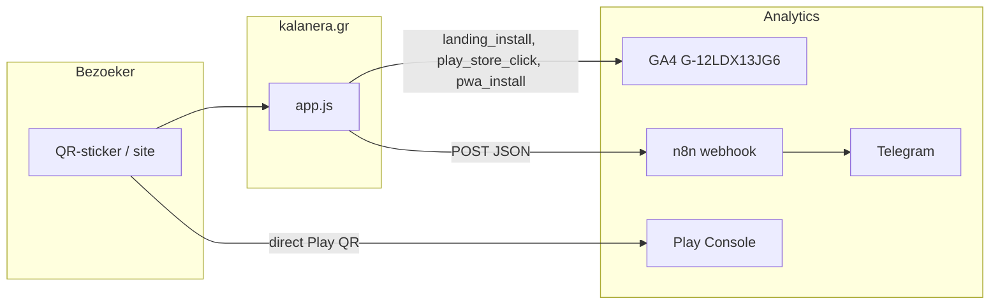

# Kala Nera — installatie-tracking (QR-stickers, GA4, n8n, Telegram)

Referentiedocument voor het meten van **installatie-intentie** via stickers en website.  
Focus op install-paden; **geen** tracking op de homepage (EN/EL).

---

## Doel

Realtime inzicht wanneer bezoekers:

1. de **installpagina** openen (QR-sticker of link),
2. op **Google Play** tikken (indirect install-pad),
3. de **PWA** op het home screen zetten (Chrome, geen Play Store).

Telegram-meldingen via n8n; historische analyse via GA4.

---

## Wat wel en niet wordt gemeten

| Actie bezoeker | Telegram (n8n) | GA4-event | Opmerking |
|---|---|---|---|
| Homepage bezoeken (`/`, `index*.html`) | Nee | Alleen standaard pageview | Bewust uitgesloten |
| Installpagina openen (`/install*.html`) | Ja 📲 | `landing_install` | Sticker-QR naar installpagina |
| Play-knop/QR-link op site | Ja ▶️ | `play_store_click` | Footer, installpagina, menu |
| Play Store-QR op sticker (direct naar Google) | Nee | Nee | Gaat langs de website |
| App installeren via Play Store | Nee (realtime) | Nee | Alleen Google Play Console (vertraagd) |
| PWA “Add to home screen” (Chrome) | Ja ✅ | `pwa_install` | `appinstalled`-event in browser |

**Bezoeker merkt niets:** geen pop-up, geen extra scherm. Alleen een klein achtergrond-POST naar n8n (productie) en bestaande GA4.

---

## Architectuur



---

## Drie events

| Event | Trigger in app.js | Betekenis |
|---|---|---|
| `landing_install` | Page load op `/install.html` of `/install-el.html` (na 800 ms) | Iemand is op de installpagina |
| `play_store_click` | Klik op `.js-play-store-promo` of `openPlayStoreListing()` (menu Android) | Intentie: Play Store openen |
| `pwa_install` | Browser-event `appinstalled` | PWA staat op home screen |

### `click_source` (alleen `play_store_click`)

| Waarde | Herkomst |
|---|---|
| `footer` | Play-badge of QR in footer |
| `install_landing` | Play-badge op installpagina |
| `hero` | Play-badge in hero (indien aanwezig) |
| `menu_android` | More-menu / handmatige Android-flow |
| `unknown` | Fallback |

---

## Website (`app.js`)

**Locatie:** `app.js` — blok rond regels 1003–1165 en `initInstallPathTracking()` (~6267).

### Constanten

```javascript
N8N_INSTALL_TRACKING_WEBHOOK_URL = 'https://n8n.vanlaar.cloud/webhook/kalanera-install-tracking'
N8N_INSTALL_TRACKING_TOKEN = ''  // optioneel, zelfde als n8n Header Auth
```

Alleen actief op productie: `www.kalanera.gr` / `kalanera.gr` (niet LAN/localhost).

### Gedrag

- **Install landing:** `trackInstallLandingIfRelevant()` alleen op `/install.html` en `/install-el.html`.
- **Play-klik:** event delegation op `.js-play-store-promo` (capture phase, vóór navigatie).
- **PWA:** alleen via `appinstalled` (niet dubbel bij prompt `accepted`).
- **Dedupe client-side:** `landing_install` en `pwa_install` — zelfde pagina binnen 3 min / 1 min via `sessionStorage`.
- **Privacy:** geen tracking op `privacy.html` / `privacy-el.html`.

### Oude app-stats webhook

`ENABLE_N8N_APP_STATS = false` — vervangen door dit install-tracking-systeem. Oude webhook: `/webhook/app-stats`.

---

## n8n-workflow

**Bestand:** [`kalanera-install-tracking-workflow.json`](./kalanera-install-tracking-workflow.json)

**Webhook:** `POST https://n8n.vanlaar.cloud/webhook/kalanera-install-tracking`

### Flow

```
Webhook
  → Validate install payload (+ server-side dedupe landing_install, 3 min)
  → Payload valid?
       ├─ nee → Respond 400
       └─ ja → Notify?
            ├─ skip (dedupe of eigen IP) → Respond OK (stil)
            └─ ja → Route by event
                 ├─ landing_install  → Telegram
                 ├─ play_store_click → Telegram
                 └─ pwa_install      → Telegram
                      → Respond OK
```

### Filters in n8n

- **Validatie:** alleen events `landing_install`, `play_store_click`, `pwa_install`; verplichte velden `event`, `page_path`, `os`, `device`.
- **Dedupe server-side:** `landing_install` — zelfde event + page_path + os binnen 3 minuten → geen Telegram.
- **Eigen IP:** bezoeker-IP `145.53.105.134` → geen Telegram (voorkomt spam bij eigen testen). Aanpasbaar in node **Notify?**.

### Telegram-berichten (HTML)

**landing_install**
```
📲 Install-pagina bezocht
🕐 {timestamp_local}
📱 {os} · {device}
🔗 Direct (mogelijk QR-sticker) of referrer
📄 {page_path} ({lang})
```

**play_store_click**
```
▶️ Play Store geklikt
📍 {click_source} · {page_path}
📱 {os}
```

**pwa_install**
```
✅ PWA geïnstalleerd (home screen)
📄 {page_path}
📱 {os} · {install_method}
```

Standaard **chatId:** `1574140555` — na import controleren.

---

## Webhook payload (JSON)

```json
{
  "event": "landing_install",
  "page_path": "/install.html",
  "page_title": "Install the app | Kala Nera Guide",
  "lang": "en",
  "os": "Android",
  "device": "Mobile",
  "display_mode": "browser",
  "referrer": "direct",
  "referrer_host": "",
  "utm_source": "",
  "utm_medium": "",
  "utm_campaign": "",
  "click_source": "",
  "install_method": "",
  "app_version": "3.1.57",
  "screen": "390x844",
  "timezone": "Europe/Athens",
  "timestamp_iso": "2026-06-13T14:32:05.123Z",
  "timestamp_local": "13-6-2026, 17:32:05"
}
```

| Veld | `landing_install` | `play_store_click` | `pwa_install` |
|---|---|---|---|
| `click_source` | leeg | footer / install_landing / … | leeg |
| `install_method` | leeg | leeg | `appinstalled_event` |

---

## GA4

**Property:** `G-12LDX13JG6` (gtag op alle pagina’s).

### Custom dimensions (event-scoped, handmatig in GA4 Admin)

| Parameter | Naam |
|---|---|
| `click_source` | Play click source |
| `install_method` | Install method |
| `referrer_type` | Referrer type |
| `os` | OS |
| `device` | Device type |
| `display_mode` | Display mode |

### Nuttige exploraties

- **Realtime:** events `landing_install`, `play_store_click`, `pwa_install`.
- **Trechter:** `landing_install` → `play_store_click` → (Play Console installs handmatig vergelijken).

---

## QR-codes op stickers (vaste druk)

| QR-asset | Waarschijnlijke URL | Zichtbaar voor tracking? |
|---|---|---|
| `pix/home-qr*.png` | `https://www.kalanera.gr/` | Nee (homepage niet getrackt) |
| `pix/install-qr*.png` | `https://www.kalanera.gr/install.html` | Ja → `landing_install` |
| `pix/play-store-qr*.png` | Direct Google Play | Nee → alleen Play Console |

**Beperking vaste stickers:** geen onderscheid per locatie/sticker zonder UTM of unieke short URL (`/go/hotel-x`). Wel totaal aantal installpagina-bezoeken en Play-klikken.

---

## Implementatie-checklist

- [ ] `app.js` met install-tracking deployen naar productie
- [ ] n8n: [`kalanera-install-tracking-workflow.json`](./kalanera-install-tracking-workflow.json) importeren
- [ ] Telegram-credential en chatId controleren
- [ ] Workflow **activeren**
- [ ] Optioneel: Header Auth op webhook + `N8N_INSTALL_TRACKING_TOKEN` in app.js
- [ ] GA4 custom dimensions aanmaken
- [ ] Test (zie hieronder)

---

## Testen

### curl (n8n)

```bash
curl -X POST "https://n8n.vanlaar.cloud/webhook/kalanera-install-tracking" \
  -H "Content-Type: application/json" \
  -d "{\"event\":\"landing_install\",\"page_path\":\"/install.html\",\"page_title\":\"Install\",\"lang\":\"en\",\"os\":\"Android\",\"device\":\"Mobile\",\"display_mode\":\"browser\",\"referrer\":\"direct\",\"referrer_host\":\"\",\"click_source\":\"\",\"install_method\":\"\",\"app_version\":\"3.1.57\",\"screen\":\"390x844\",\"timezone\":\"Europe/Athens\",\"timestamp_iso\":\"2026-06-13T12:00:00.000Z\",\"timestamp_local\":\"13-6-2026, 15:00:00\"}"
```

Verwacht: HTTP 200 `{"ok":true}` + Telegram binnen enkele seconden.

### Op telefoon (productie)

1. Open `https://www.kalanera.gr/install.html` → Telegram 📲
2. Tik Play-badge in footer → Telegram ▶️
3. GA4 → DebugView / Realtime voor de drie events

---

## Voorbeeld: drukke dag met stickers

- 10× install-QR gescand → ~10× 📲 (minus dubbel-scans binnen 3 min)
- 4× Play-knop op site → 4× ▶️
- 2× PWA via Chrome → 2× ✅
- 5× direct Play Store-QR op sticker → **0 meldingen**; installs later in Play Console

---

## Toekomst (volgende sticker-druk)

- Unieke URLs per locatie: `kalanera.gr/go/agelis?utm_source=sticker`
- Play Store-link met referrer: `&referrer=utm_source%3Dwebsite%26utm_medium%3Dinstall_page`
- Optioneel: Google Sheet-log in n8n (patroon: [`kdbd-app-tracking-workflow.json`](./kdbd-app-tracking-workflow.json))

---

## Gerelateerde bestanden

| Bestand | Rol |
|---|---|
| `app.js` | Client-side tracking + GA4 events |
| `n8n/kalanera-install-tracking-workflow.json` | n8n import |
| `install.html`, `install-el.html` | Install landing (QR-doel) |
| `pix/install-qr-*.png`, `pix/play-store-qr-*.png` | QR-assets op site/stickers |
| `n8n/kdbd-app-tracking-workflow.json` | Oudere app-open tracking (uitgeschakeld in app.js) |

---

*Laatste update: juni 2026 — install-pad tracking, geen homepage.*
